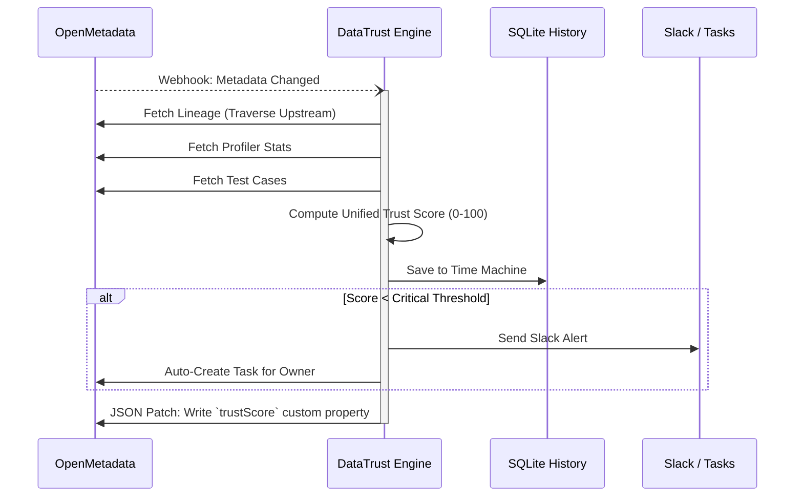

# 🛡️ DataTrust Engine

**Unified trust scores for your data assets — powered by OpenMetadata.**

DataTrust Engine is a standalone observability tool that connects to your OpenMetadata instance and computes a **0–100 Trust Score** for every data asset. It aggregates signals from data quality tests, lineage health, governance compliance, and data freshness into a single, actionable number.

> _"How much can I trust this table?"_ — DataTrust answers that question.

---

## The Problem

Data teams manage hundreds of tables across multiple services. OpenMetadata captures rich metadata — test results, lineage graphs, ownership, profiling timestamps — but there's no unified view that says: **"This table is trustworthy"** or **"This one needs attention."**

Teams end up manually checking multiple tabs, running mental calculations, and missing degradation until it causes downstream failures.

## The Solution

DataTrust Engine:

1. **Collects signals** from OpenMetadata's REST APIs (Quality, Lineage, Governance, Freshness)
2. **Computes weighted trust scores** for every table
3. **Tracks trends over time** (the "Trust Time Machine")
4. **Surfaces risks** through a premium dashboard with grade badges, drill-downs, and alerts

---

## Architecture



## Signal Weights

| Signal | Weight | What it Measures |
|:---|:---:|:---|
| **Data Quality** | 35% | Test case pass/fail rates from DQ framework |
| **Governance** | 25% | Ownership, descriptions, tier tags, column docs |
| **Lineage** | 25% | Upstream source health + edge connectivity |
| **Freshness** | 15% | Time since last profiler run (decay curve) |

---

## Quick Start

### Option 1: Full stack (recommended)

```bash
# Clone the repo
git clone https://github.com/YOUR_USERNAME/DataTrustEngine.git
cd DataTrustEngine

# Start everything — OpenMetadata + DataTrust Engine
docker compose -f deploy/docker-compose.yml up -d
```

- **Dashboard**: http://localhost:4000
- **OpenMetadata**: http://localhost:8585 (admin/admin)

### Option 2: Connect to existing OpenMetadata

```bash
cd backend
mvn package -DskipTests

# Point at your OM instance
export OM_SERVER_URL=http://your-om-server:8585
export OM_USER=admin
export OM_PASSWORD=admin

java -jar target/datatrust-engine-1.0.0.jar
```

---

## API Endpoints

| Method | Path | Description |
|:---|:---|:---|
| `GET` | `/api/scores` | All tables with current trust scores |
| `GET` | `/api/scores/stats` | Summary stats (avg, healthy, warning, critical) |
| `GET` | `/api/scores/{fqn}` | Single table with full breakdown |
| `GET` | `/api/scores/{fqn}/history` | Historical trust trend (Time Machine) |
| `POST` | `/api/engine/run` | Trigger an on-demand scoring cycle |
| `GET` | `/api/engine/status` | Engine health and configuration |
| `GET` | `/api/health` | Service health check |

---

## How It Integrates with OpenMetadata

DataTrust Engine leverages these OpenMetadata APIs:

- **`GET /api/v1/tables`** — Fetches all table entities with owner, tags, columns, profile data
- **`GET /api/v1/dataQuality/testCases`** — Retrieves DQ test results per table (entity link filtering)
- **`GET /api/v1/lineage/table/{id}`** — Traverses upstream/downstream lineage graph (depth=3)
- **`POST /api/v1/users/login`** — JWT authentication for secure API access
- **`GET /api/v1/system/version`** — Health check and version verification

Every signal in the trust score comes directly from OpenMetadata's own metadata catalog.

---

## Tech Stack

- **Backend**: Java 21, Javalin, OkHttp, Jackson, SQLite
- **Frontend**: Vanilla HTML/CSS/JS, Chart.js
- **Deployment**: Docker, Docker Compose
- **Data Source**: OpenMetadata 1.12.5 REST API

---

## Configuration

All configuration is via environment variables:

| Variable | Default | Description |
|:---|:---|:---|
| `OM_SERVER_URL` | `http://localhost:8585` | OpenMetadata server URL |
| `OM_USER` | `admin` | Login email |
| `OM_PASSWORD` | `admin` | Login password |
| `OM_BOT_TOKEN` | — | Bot JWT token (alternative to user/pass) |
| `PORT` | `4000` | Dashboard + API port |
| `SCORING_INTERVAL_MINUTES` | `5` | How often to recompute scores |
| `DB_PATH` | `datatrust.db` | SQLite database path |

---

## Project Structure

```
DataTrustEngine/
├── backend/
│   ├── pom.xml
│   └── src/main/java/io/datatrust/
│       ├── App.java                    # Entry point
│       ├── api/
│       │   ├── OpenMetadataClient.java # OM REST API wrapper
│       │   └── TrustApiController.java # Javalin routes
│       ├── collectors/
│       │   ├── SignalCollector.java     # Interface
│       │   ├── DataQualityCollector.java
│       │   ├── GovernanceCollector.java
│       │   ├── LineageCollector.java
│       │   └── FreshnessCollector.java
│       ├── engine/
│       │   ├── TrustScoreEngine.java   # Orchestrator
│       │   ├── ScoreAggregator.java    # Weighted math
│       │   └── HistoryStore.java       # SQLite persistence
│       └── model/
│           ├── TrustScore.java
│           ├── SignalBreakdown.java
│           └── AssetInfo.java
├── dashboard/
│   ├── index.html
│   ├── css/styles.css
│   └── js/app.js
├── deploy/
│   └── docker-compose.yml
├── Dockerfile
└── README.md
```

---

## License

MIT

---

*Built for the OpenMetadata Hackathon — Track: Data Observability*
